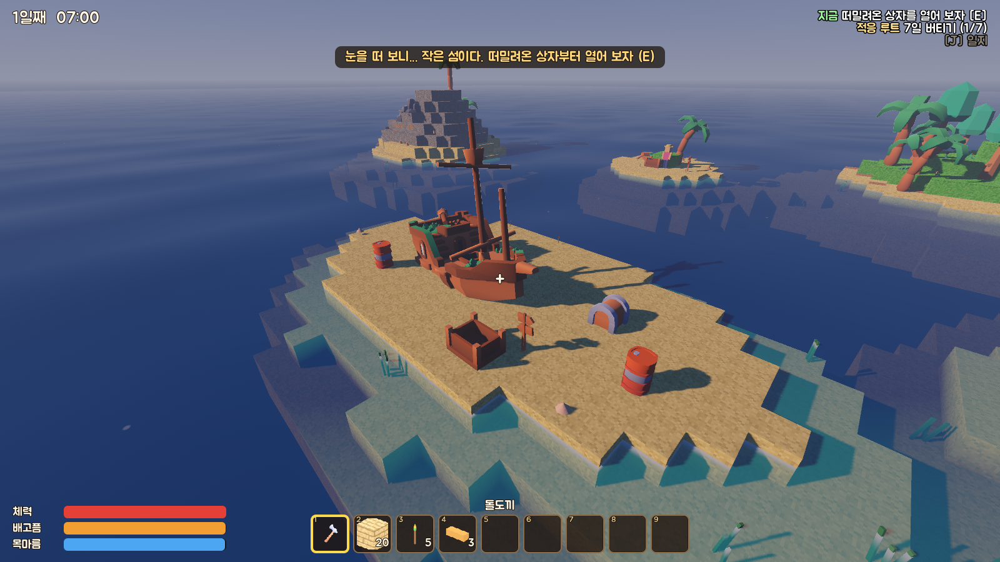
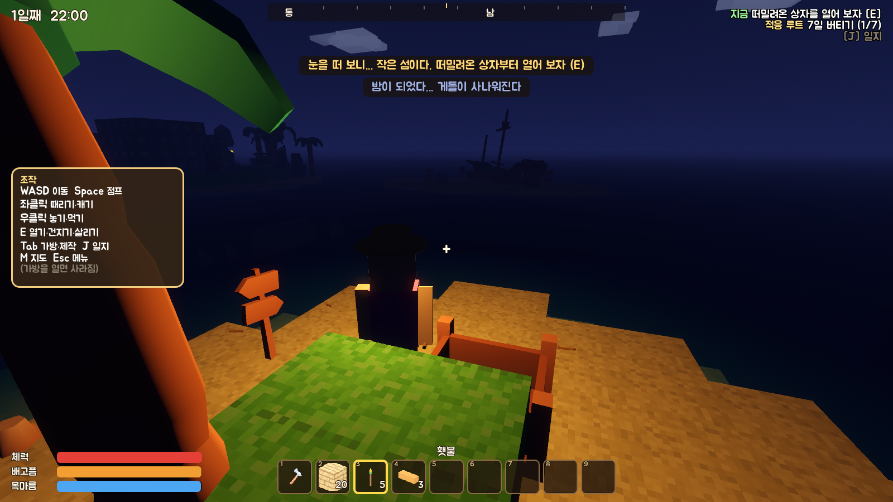
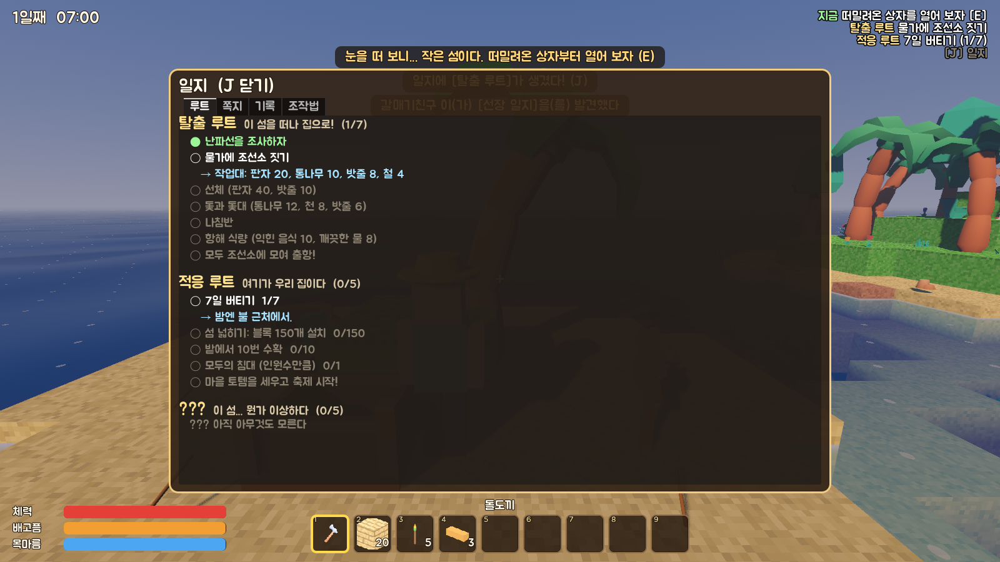
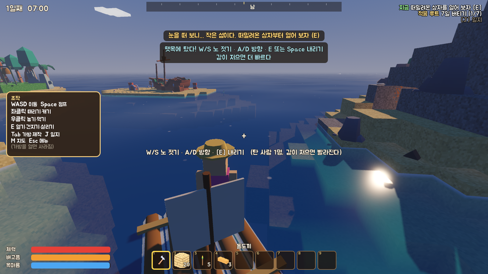
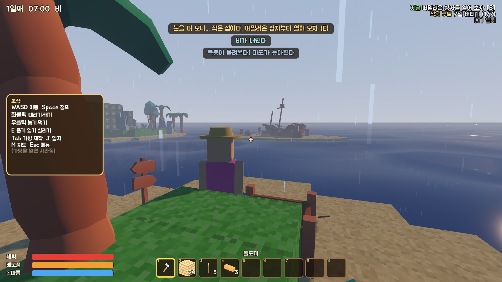
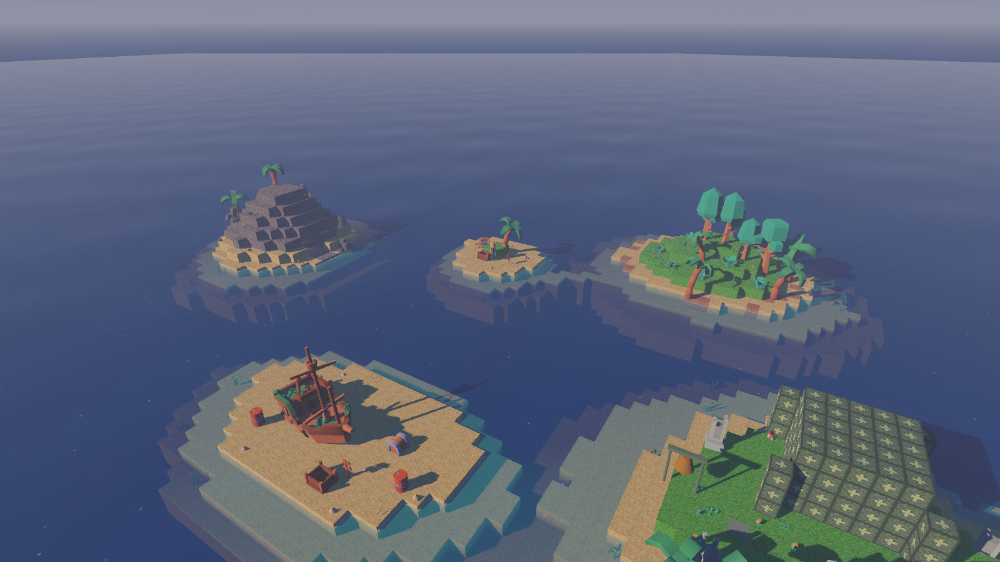
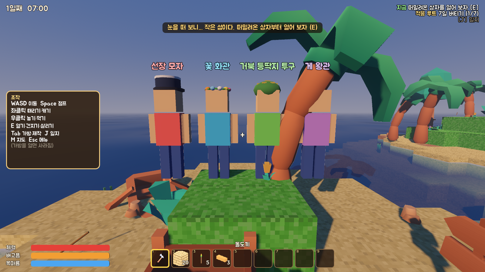

# 무인도 버디즈 (Castaway Buddies)

친구랑 같이 무인도에서 살아남는 **허접 로우폴리 협동 생존 게임**.
마크 스카이블럭처럼 손바닥만 한 섬에서 시작해서, 블록을 놓아 섬을 넓히고, 떠내려오는 잔해를 건지고,
게와 상어를 피해 가며 세 갈래 결말 중 하나에 닿는다.

- 엔진: Godot 4.7 (Steam 판) · Forward+ (안 되는 PC 는 자동으로 호환 렌더러)
- 인원: 1~4명 (혼자 하기 / 방 만들기 / 참가하기)
- 저장: 섬 3칸 (새 섬마다 난이도: 느긋하게 / 보통 / 빡빡하게). 친구 가방은 친구 이름으로 저장된다
- 엔딩·게 왕을 깨면 **모자**가 풀린다 (선장 모자 · 꽃 화관 · 거북 등딱지 투구 · 게 왕관) — 타이틀에서 골라 쓰면 친구들 눈에도 보인다
- **웹에서 바로 하기 (혼자 하기 전용)**: https://gammja17.github.io/CastawayBuddies/
- **친구랑 같이 하기 (Windows)**: [Releases](https://github.com/Gammja17/CastawayBuddies/releases) 에서 `CastawayBuddies.exe` 받아 실행 (한 파일, 설치 없음)
- 브라우저는 서버를 열 수 없어서 웹판엔 방 만들기/참가하기가 없다. 웹에서 마우스가 풀리면 화면을 한 번 클릭

| | |
|---|---|
|  |  |
|  |  |
|  |  |
|  |  |
|  |  |

## 세 갈래 결말

| 루트 | 무엇을 하나 | 실마리 |
|---|---|---|
| **탈출** | 난파선 선장 일지 → 물가에 조선소 → 선체·돛·나침반·식량을 다 같이 채우고 모두 모여 출항 | 남쪽 모래톱의 난파선 |
| **적응** | 7일 버티기 · 블록 120개로 섬 넓히기 · 밭 수확 10번 · 인원수만큼 침대 → 마을 토템 축제 | 병 속 쪽지 |
| **???** | (스포일러) 섬이 가끔 흔들린다. 고대 석판 셋, 거북 제단, 황금 조개 셋, 그리고 두 개의 종 | 2일째 지진, 돌섬 동굴(입구 바위는 둘이서 밀기) |

처음엔 좀 빡빡하다: 목마름이 빨리 닳고, 밤엔 게가 사나워지고, 깊은 바다에 오래 있으면 상어가 온다.
대신 오른쪽 위 **"지금 할 일"**, 떠밀려온 상자 속 **김씨의 쪽지**, 떠다니는 **병 속 쪽지**, **일지(J)** 가 길을 알려준다.

## 조작

| 키 | 동작 |
|---|---|
| WASD / Shift / Space | 이동 / 달리기 / 점프·헤엄쳐 오르기 (한 칸 턱은 자동 점프) |
| 마우스 · V | 둘러보기 · 1인칭/3인칭 |
| 좌클릭 (꾹) | 때리기 · 캐기 · 부수기 · 낚싯대/갈고리 던지기 |
| 우클릭 | 블록/설치물 놓기 · 먹기 · 빈 병에 바닷물 뜨기 |
| E (꾹) | 상호작용 · 잔해 건지기 · 뗏목 타기/내리기 · 기절한 친구 살리기(꾹) — 바닥 물건은 걸어가면 자동으로 주워진다 |
| 1~9 · 휠 · Q | 단축바 · 버리기 (Ctrl+Q 전부) |
| Tab · J · M | 가방/제작 · 일지 · 지도 |
| F / 휠클릭 · T · G | 핑 찍기 · 채팅 · 손 흔들기 |
| Esc | 메뉴 (친구 초대 주소가 여기 보인다) · 설정에서 그래픽 품질(느린 PC 는 "낮음") |

## 섬에서 할 수 있는 것

- **채집·제작**: 아이템 70여 개, 조합법 50여 개 (맨손 / 작업대 / 모닥불 / 화덕)
- **섬 넓히기**: 모래·흙·판자·돌·벽돌·유리·초가·통나무·사암·잎 블록. 판자 블록은 물 위에도 놓여서 다리를 놓을 수 있다. 모래 포집기는 파도가 모래를 쌓아 준다
- **생존**: 배고픔·목마름·체력, 바닷물 끓이기, 빗물받이, 밭(감자·산딸기), 통발, 낚시(좌클릭 던지기 → ! 뜨면 좌클릭)
- **떠내려오는 잔해**: 판자·통·상자·병 속 쪽지. 갈고리로 멀리서 낚아챌 수 있다
- **뗏목**: 바다를 보고 우클릭으로 띄우고 E 로 탄다. 탄 사람이 **같이 노를 저을수록 빨라진다** (최대 4명). 뗏목 위에선 상어가 못 문다. 뗏목 위 낚시도 된다
- **집 짓기**: 나무 문, 침대(부활 장소), 공용 상자, 횃불
- **날씨**: 낮/밤(하루 12분), 비, 폭풍(번개·높은 파도), 가끔 섬이 흔들린다(?)
- **말썽꾼들**: 게(밤엔 사나움, 불빛을 무서워함), 상어(깊은 물에서 오래 헤엄치면), 게 왕(유적섬), 갈매기 도둑(음식을 들고 있으면 채 간다 — 때리면 떨군다)

## 협동 요소

- 기절하면 30초 안에 친구가 **E 꾹**으로 살려줄 수 있다 (혼자면 침대로 돌아감, 가방은 그 자리에)
- 상자는 모두가 같이 쓴다 · 조선소 재료는 다 같이 넣는다 · 핑과 채팅
- 돌섬 동굴 입구의 큰 바위는 **둘이 동시에 E** 로 밀어야 굴러간다 (혼자면 철곡괭이를 지렛대로)
- 신전 문은 **압력판 두 개를 동시에** 눌러야 열린다 (혼자면 한쪽에 블록을 올려 두자)
- 마지막 종은 **두 사람이 동시에** 쳐야 한다 (혼자면 태엽 종치기)
- 게 왕은 혼자 잡기 벅차다
- 친구를 때리면 데미지 없이 뿅 날아간다 (진짜 쓸데없음)

## 친구랑 하기

1. 방장: **방 만들기** → 섬 고르기. 포트 기본 `24680` (UDP). UPnP 가 되는 공유기면 자동으로 열린다
   (처음 방을 만들 때 Windows 방화벽 창이 뜨면 **허용**)
2. 친구: **친구 방에 참가하기** → 방장 주소 입력. 방장 화면에서 Esc 누르면 주소가 보인다
3. 같은 와이파이면 내부 IP 로 바로. 인터넷 너머면 방장 공유기 포트포워딩(UDP 24680) 또는 **Radmin VPN / ZeroTier / Tailscale** 같은 가상 랜
4. 도중에 들어와도 된다. 나갔다 다시 들어오면 가방·위치가 이름으로 돌아온다

## 폴더

| 폴더 | 내용 |
|---|---|
| `scenes/` | 게임(`game.tscn`), 캐릭터(`player.tscn`), UI(`ui/*.tscn`) — UI 는 씬으로 만든다 |
| `scripts/autoload/` | `items.gd`(모든 아이템·조합법·블록·구조물 숫자), `net.gd`(접속), `audio.gd`, `vis.gd`(모양 공장), `settings.gd` |
| `scripts/world/` | `game.gd`(한 판·저장·엔딩), `worldgen.gd`(섬 생성), `terrain.gd`(블록), `props.gd`(채집물), `structs.gd`(설치물·상호작용), `ents.gd`(떨어진 아이템·잔해·게·상어·게 왕·갈매기·뗏목), `clock.gd`(낮밤·비·폭풍·지진), `quests.gd`(루트·쪽지), `ending_cine.gd`(엔딩 연출), `ambience_fx.gd`(구름·물고기) |
| `scripts/player/` | 캐릭터, 가방 |
| `assets/` | Kenney 모델·효과음(CC0), 합성 음악, Jua 글꼴, 아이콘 |
| `tools/` | 검사·테스트 도구 (빌드엔 안 들어감) |

## 개발용 도구

```bash
godot --headless --path . tools/check.tscn            # 모든 스크립트/씬 불러 보기
godot --headless --path . tools/smoke.tscn            # 혼자 하기 기본 동작
godot --headless --path . tools/route_test.tscn -- turtle   # adapt / escape 도 가능: 엔딩까지 실제 조작으로
godot --headless --path . tools/route_test.tscn -- turtle solo   # 혼자 거북이 루트 (태엽 종치기)
godot --headless --path . tools/systems_test.tscn     # 묘목·밭·빗물·모래·화덕·낚시·동굴 바위·뗏목
godot --headless --path . tools/load_test.tscn        # 저장 → 불러오기 왕복
godot --headless --path . tools/soak.tscn             # 20배속으로 며칠 돌리기
godot --headless --path . tools/mp_test.tscn -- host  # 다른 창에서 -- client : 2인 접속 테스트 (뗏목 포함)
godot --path . tools/icons.tscn                       # 아이템 아이콘 다시 굽기
godot --path . tools/shot.tscn -- <폴더> start        # 화면 찍기 (wide/night/ui/journal/map/ship/ending_turtle ...)
python tools/gen_audio.py                             # 음악·효과음 다시 합성
godot --headless --path . --export-release "Windows" builds/windows/CastawayBuddies.exe
```

숫자(배고픔 속도, 조합 재료, 적 체력 등)는 거의 다 `scripts/autoload/items.gd` 와 각 스크립트 맨 위 상수에 있다.

크레딧은 `CREDITS.md`.
