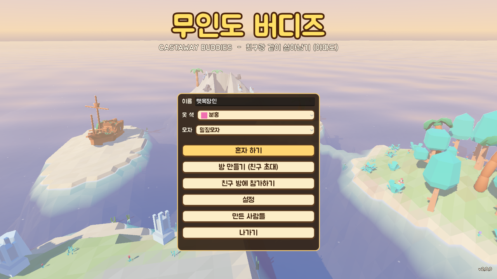
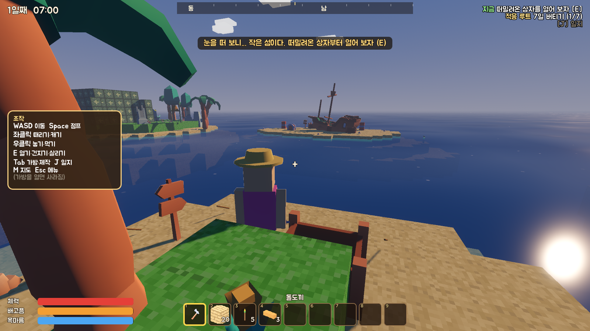
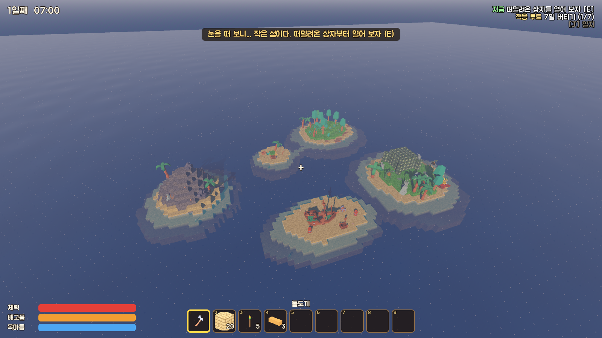
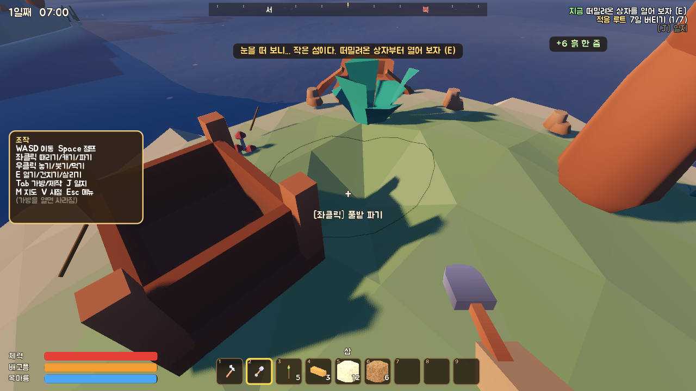
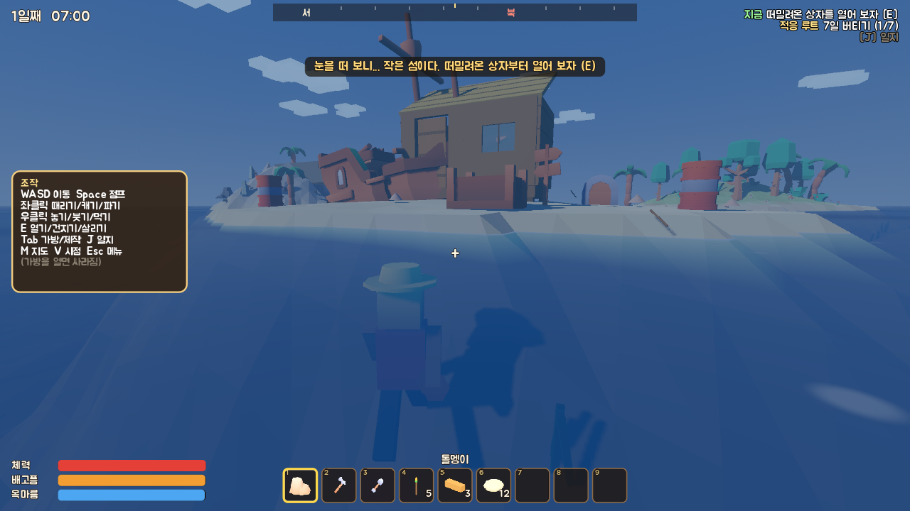
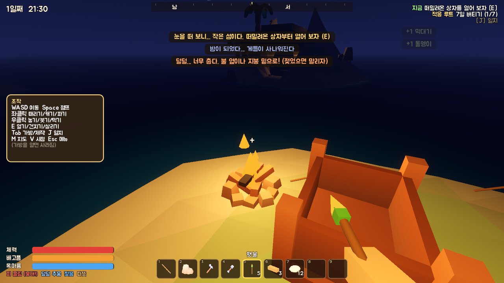
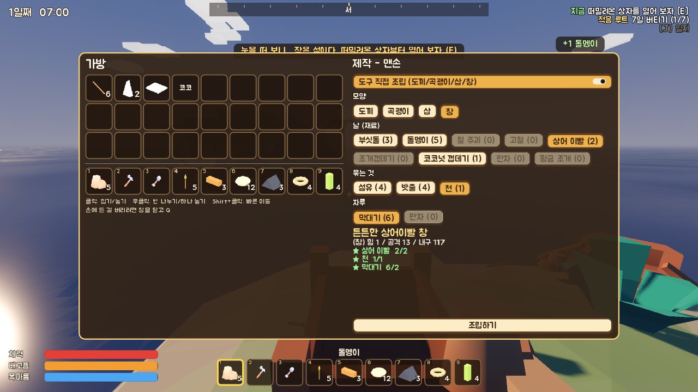
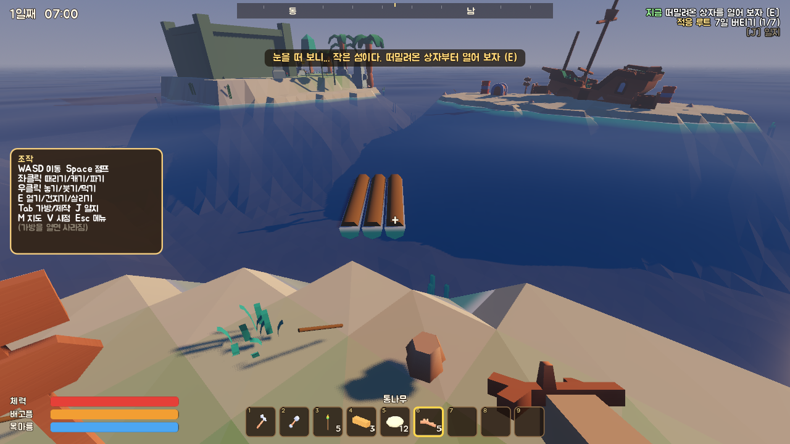
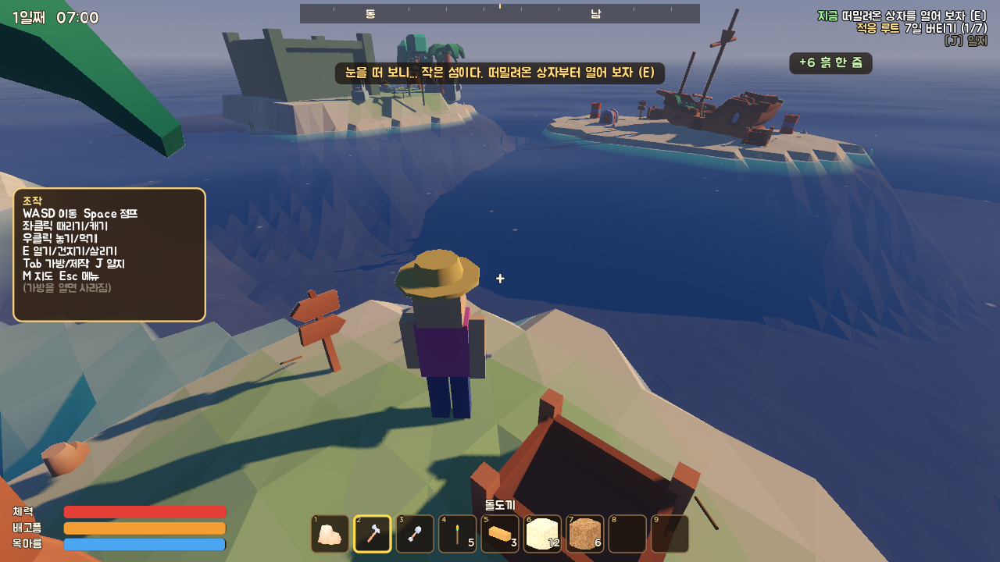
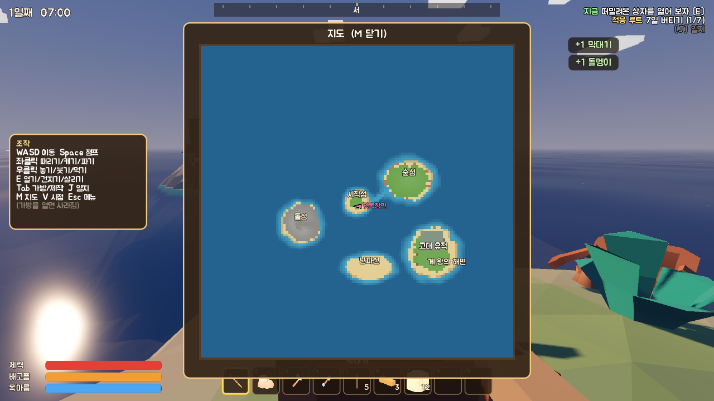

# 무인도 버디즈 (Castaway Buddies)

친구랑 같이 무인도에서 살아남는 **허접 로우폴리 협동 생존 게임**. v2 부터는 **1인칭 + 매끈한 섬**.
손바닥만 한 섬에서 시작해서, 삽으로 파고 모래를 부어 섬을 넓히고, 부품을 하나하나 붙여 집을 짓고,
불 하나 피우는 것도 번거롭게 살아남아서 세 갈래 결말 중 하나에 닿는다.

- 엔진: Godot 4.7 (Steam 판) · Forward+ (안 되는 PC 는 자동으로 호환 렌더러)
- 인원: 1~4명 (혼자 하기 / 방 만들기 / 참가하기)
- 저장: 섬 3칸 (새 섬마다 난이도: 느긋하게 / 보통 / 빡빡하게). 친구 가방·몸 상태는 친구 이름으로 저장된다
- 엔딩·게 왕을 깨면 **모자**가 풀린다 (선장 모자 · 꽃 화관 · 거북 등딱지 투구 · 게 왕관) — 타이틀에서 골라 쓰면 친구들 눈에도 보인다
- **웹에서 바로 하기 (혼자 / 친구랑 방 코드로)**: https://gammja17.github.io/CastawayBuddies/
- **Windows 판**: [Releases](https://github.com/Gammja17/CastawayBuddies/releases) 에서 `CastawayBuddies.exe` 받아 실행 (한 파일, 설치 없음).
  켤 때마다 최신 릴리스를 확인해서, 새 버전이면 타이틀 오른쪽 위에 **"지금 업데이트"** 가 뜬다 (받아서 바꿔 끼우고 다시 켜진다)
- 웹판끼리, PC판끼리 같이 할 수 있다 (웹판과 PC판은 서로 못 만난다). 웹에서 마우스가 풀리면 화면을 한 번 클릭

| | |
|---|---|
|  |  |
|  |  |
|  |  |
|  |  |
|  |  |

## 세 갈래 결말

| 루트 | 무엇을 하나 | 실마리 |
|---|---|---|
| **탈출** | 난파선 선장 일지 → 물가에 조선소 → 선체·돛·나침반·식량을 다 같이 채우고 모두 모여 출항 | 남쪽 모래톱의 난파선 |
| **적응** | 7일 버티기 · 땅 40칸 늘리기 (모래 붓기 / 물 위에 기초) · 밭 수확 10번 · **지붕 아래** 인원수만큼 침대 → 마을 토템 축제 | 병 속 쪽지 |
| **???** | (스포일러) 섬이 가끔 흔들린다. 고대 석판 셋, 거북 제단, 황금 조개 셋, 그리고 두 개의 종 | 2일째 지진, 돌섬 동굴(입구 바위는 둘이서 밀기) |

처음엔 좀 빡빡하다: 목마름이 빨리 닳고, 불은 저절로 안 붙고, 밤엔 게가 사나워지고, 젖은 채로 밤을 새우면 얼어 죽는다.
대신 오른쪽 위 **"지금 할 일"**, 떠밀려온 상자 속 **김씨의 쪽지**, 떠다니는 **병 속 쪽지**, **일지(J)** 가 길을 알려준다.

## 조작

| 키 | 동작 |
|---|---|
| WASD / Shift / Space | 이동 / 달리기 / 점프·헤엄쳐 오르기 (물가 턱은 알아서 폴짝) |
| 마우스 · V | 둘러보기 · 1인칭(기본)/3인칭 |
| 좌클릭 (꾹) | 때리기 · 캐기 · **땅 파기**(삽/곡괭이) · 부수기 · **활비비로 불 피우기** · 낚싯대/갈고리 던지기 |
| 우클릭 | 설치물·**건축 부품** 놓기 · **모래/흙 붓기** · **통나무 띄우기** · 먹기 · 병/코코넛 껍데기로 물 뜨기 · 작업대에 대고 **도구 수리** |
| E (꾹) | 상호작용 · **장작 넣기 / 석쇠에 올리기·꺼내기** · **통나무 묶기** · 잔해 건지기 · 뗏목 타기/내리기 · 기절한 친구 살리기(꾹) |
| 1~9 · 휠 · Q | 단축바 · 버리기 (Ctrl+Q 전부) |
| Tab · J · M | 가방/제작/**도구 조립** · 일지 · 지도 |
| F / 휠클릭 · T · G | 핑 찍기 · 채팅 · 손 흔들기 |
| Esc | 메뉴 (친구 초대 주소가 여기 보인다) · 설정에서 그래픽 품질(느린 PC 는 "낮음") |

## 섬에서 할 수 있는 것

- **땅 파기·붓기**: 삽(흙·모래·점토)과 곡괭이(바위)로 판다. 판 흙·모래를 물가에 부으면 땅이 된다 (물에 부은 모래는 가라앉아 평평하게 퍼진다). 고대 돌바닥은 못 판다
- **부품 건축** (2m 격자, 자석처럼 붙는다): 나무 기초 · 바닥 · 벽 · 창문 벽 · 문틀 벽(+문) · 계단 · 야자잎 지붕 · 기둥.
  기초는 땅이나 얕은 물에 다리를 박아 세운다 — **물 위 기초 한 장 = 땅 4칸**. 기초 위엔 작업대·침대·상자를 놓을 수 있다
- **번거로운 생존**
  - 불: 모닥불에 장작(나무·판자·막대·야자잎)을 넣고 **활비비**로 비벼야 붙는다. 가끔 연기만 나고 실패, 비 맞으면 안 붙는다. 장작이 다 타면 꺼진다
  - 요리: 날것을 석쇠에 올리면 20초에 익고 50초 넘으면 탄다
  - 음식은 가방에서 썩는다 (상자는 서늘해서 안 썩음). 날것·썩은 걸 먹으면 **배탈** (가끔 토한다)
  - 비·바다에 **젖으면** 밤에 **덜덜** — 체력이 깎인다. 지붕 밑·불 옆이 살 길
  - 세게 맞으면 **피**를 흘린다 → 붕대. 그냥 두면 상처가 곪을 수도
  - 도구는 닳는다 → 작업대에 대고 우클릭으로 수리
- **직접 조립**: 도구는 모양(도끼·곡괭이·삽·창) + 날(부싯돌·돌·쇠·고철·상어이빨·조개·코코넛 껍데기·나무판·황금 조개) + 묶는 것(섬유·밧줄·천) + 자루(막대기·판자)를 골라 조립. 조합마다 힘·공격·내구가 다르다 ("튼튼한 상어이빨 창", "묵직한 코코넛 삽"...)
- **통나무 뗏목**: 통나무를 물에 나란히 띄우고(4개 이상) 밧줄로 묶으면 뗏목이 된다. **같이 노를 저을수록 빨라진다** (최대 4명). 뗏목 위에선 상어가 못 문다
- **다른 쓰임새**: 코코넛 껍데기 = 컵, 야자잎 = 우산, 썩은 음식 = 밭 거름, 친구 머리 = 발판
- **그 밖에**: 밭(감자·산딸기), 빗물받이, 통발, 모래 포집기, 낚시, 떠내려오는 잔해(갈고리로 낚아채기), 낮/밤·비·폭풍·지진(?)
- **말썽꾼들**: 게(밤엔 사나움, 불빛을 무서워함 — 꺼진 불은 소용없다), 상어(깊은 물에서 오래 헤엄치면), 게 왕(유적섬), 갈매기 도둑(음식을 들고 있으면 채 간다 — 때리면 떨군다)

## 협동 요소

- 기절하면 30초 안에 친구가 **E 꾹**으로 살려줄 수 있다 (혼자면 침대로 돌아감, 가방은 그 자리에)
- 친구 **머리 위에 올라설 수 있다** (높은 데 올라갈 때)
- 상자는 모두가 같이 쓴다 · 조선소 재료는 다 같이 넣는다 · 핑과 채팅
- 돌섬 동굴 입구의 큰 바위는 **둘이 동시에 E** 로 밀어야 굴러간다 (혼자면 쇠 곡괭이를 지렛대로)
- 신전 문은 **압력판 두 개를 동시에** 눌러야 열린다 (혼자면 한쪽에 상자 같은 무거운 걸 올려 두자)
- 마지막 종은 **두 사람이 동시에** 쳐야 한다 (혼자면 태엽 종치기)
- 게 왕은 혼자 잡기 벅차다
- 친구를 때리면 데미지 없이 뿅 날아간다 (진짜 쓸데없음)

## 친구랑 하기

**웹판 (방 코드)**
1. 방장: **방 만들기** → 섬 고르기. 화면 위에 **방 코드**(예: `KRGX7`)가 뜬다. Esc 를 누르면 코드와 **초대 링크**, "초대 링크 복사" 버튼이 있다
2. 친구: 초대 링크를 누르거나, 웹판에서 **친구 방에 참가하기** → 방 코드 입력
3. 브라우저끼리 직접 연결한다 (WebRTC). 처음 서로 찾는 것만 공개 중개 서버(PeerJS)를 빌려 쓴다.
   공유기·회사망에 따라 가끔 연결이 안 될 수 있다 — 그럴 땐 PC판으로

**PC판 (주소)**
1. 방장: **방 만들기** → 섬 고르기. 포트 기본 `24680` (UDP). UPnP 가 되는 공유기면 자동으로 열린다
   (처음 방을 만들 때 Windows 방화벽 창이 뜨면 **허용**)
2. 친구: **친구 방에 참가하기** → 방장 주소 입력. 방장 화면에서 Esc 누르면 주소가 보인다
3. 같은 와이파이면 내부 IP 로 바로. 인터넷 너머면 방장 공유기 포트포워딩(UDP 24680) 또는 **Radmin VPN / ZeroTier / Tailscale** 같은 가상 랜
4. 도중에 들어와도 된다. 나갔다 다시 들어오면 가방·위치가 이름으로 돌아온다

v1 저장 파일은 v2 에서 이어 할 수 없다 (섬 모양이 바뀌었다). 섬 칸이 "비어 있음"으로 보이니 새 섬으로 시작하자.

## 폴더

| 폴더 | 내용 |
|---|---|
| `scenes/` | 게임(`game.tscn`), 캐릭터(`player.tscn`), UI(`ui/*.tscn`) — UI 는 씬으로 만든다 |
| `scripts/autoload/` | `items.gd`(모든 아이템·조합법·구조물·조립 재료 숫자), `net.gd`(접속), `audio.gd`, `vis.gd`(모양 공장), `settings.gd` |
| `scripts/world/` | `game.gd`(한 판·저장·엔딩), `worldgen.gd`(섬 생성), `terrain.gd`(높이맵 지형·파기·붓기), `build.gd`(건축 부품 모양·붙는 자리), `props.gd`(채집물), `structs.gd`(설치물·부품·모닥불·상호작용), `ents.gd`(떨어진 아이템·잔해·게·상어·게 왕·갈매기·뗏목), `clock.gd`(낮밤·비·폭풍·지진), `quests.gd`(루트·쪽지), `ending_cine.gd`(엔딩 연출), `ambience_fx.gd`(구름·물고기) |
| `scripts/player/` | 캐릭터, 가방, `condition.gd`(젖음·추위·배탈·피 흘림) |
| `assets/` | Kenney 모델·효과음(CC0), 합성 음악, Jua 글꼴, 아이콘 |
| `tools/` | 검사·테스트 도구 (빌드엔 안 들어감) |

## 개발용 도구

```bash
godot --headless --path . tools/check.tscn            # 모든 스크립트/씬 불러 보기
godot --headless --path . tools/smoke.tscn            # 혼자 하기 기본 동작 (파기·붓기 포함)
godot --headless --path . tools/route_test.tscn -- turtle   # adapt / escape 도 가능: 엔딩까지 실제 조작으로
godot --headless --path . tools/route_test.tscn -- turtle solo   # 혼자 거북이 루트 (태엽 종치기)
godot --headless --path . tools/systems_test.tscn     # 묘목·밭·빗물·모래·화덕·낚시·삽질·동굴 바위·뗏목
godot --headless --path . tools/build_test.tscn       # 부품 건축 (집·문·지붕·계단·물 위 기초)
godot --headless --path . tools/survival_test.tscn    # 불·석쇠·썩음·배탈·젖음·추위·피·수리·코코넛 컵
godot --headless --path . tools/assembly_test.tscn    # 도구 직접 조립 · 통나무 뗏목
godot --headless --path . tools/load_test.tscn        # 저장 → 불러오기 왕복
godot --headless --path . tools/move_test.tscn        # 걷기·헤엄·물가로 올라오기
godot --headless --path . tools/soak.tscn             # 20배속으로 며칠 돌리기
godot --headless --path . tools/mp_test.tscn -- host  # 다른 창에서 -- client : 2인 접속 테스트 (지형·부품 동기화, 머리 밟기, 뗏목)
godot --headless --path . tools/rtc_join_test.tscn -- --rtc   # 웹판 방 코드: 중개 서버 접속·없는 방 안내
node tools/web_mp_test.mjs <폴더>                      # 웹판 방 코드 멀티를 헤드리스 크롬 넷으로 (파일 맨 위 설명)
godot --path . tools/icons.tscn                       # 아이템 아이콘 다시 굽기
godot --path . tools/shot.tscn -- <폴더> start        # 화면 찍기 (wide/dig/house/fire/assemble/logs/map/ending_turtle ...)
python tools/gen_audio.py                             # 음악·효과음 다시 합성
godot --headless --path . --export-release "Windows" builds/windows/CastawayBuddies.exe
```

### 새 버전 올리기 (PC판 자동 업데이트)

1. `project.godot` 의 `config/version` 을 올린다 (예: `2.1.0`)
2. `godot --headless --path . --export-release "Windows" builds/windows/CastawayBuddies.exe`
3. `gh release create v2.1.0 builds/windows/CastawayBuddies.exe` — 태그는 `v` + 같은 번호, 파일 이름은 꼭 `CastawayBuddies.exe`

그러면 예전 exe 들이 켜질 때 GitHub 최신 릴리스를 보고 새 exe 를 받는다. 받은 파일은 GitHub 이 알려 주는 크기와 SHA-256 지문으로 확인한 뒤에야 바꿔 끼운다.
시험: `godot --headless --path . tools/update_check_test.tscn` (진짜 최신 릴리스 읽기), exe 에 `-- --update-url=<json 주소> --update-now` 를 주면 다른 곳의 "최신 릴리스" 로 바꿔 끼우기를 해 볼 수 있다.

숫자(배고픔 속도, 조합 재료, 조립 재료표, 적 체력 등)는 거의 다 `scripts/autoload/items.gd` 와 각 스크립트 맨 위 상수에 있다.

크레딧은 `CREDITS.md`.
